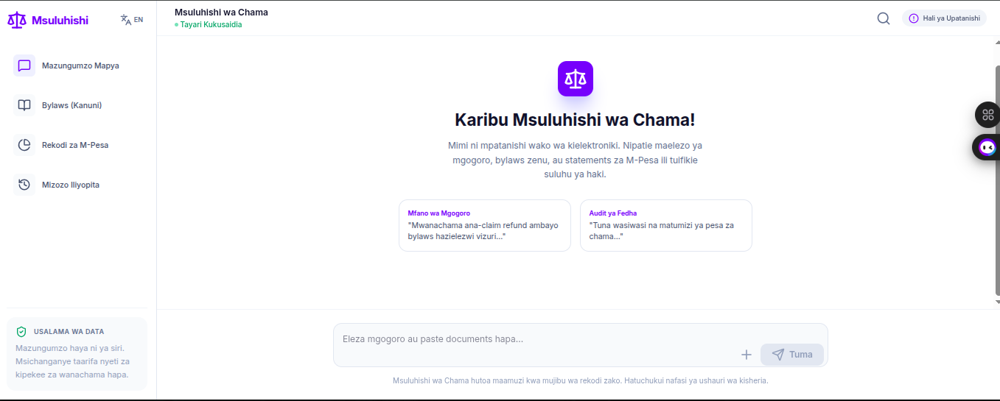
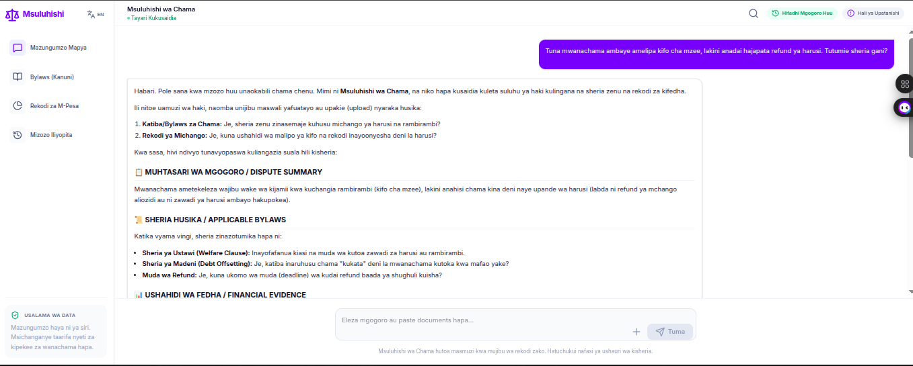

# ⚖️ Msuluhishi wa Chama (Chama Dispute Arbitrator)

> A neutral AI mediator that resolves internal disputes within Kenyan investment groups (chamas) — grounded strictly in the group's own bylaws and M-Pesa financial records.

---

## 🧩 The Problem

Chamas — informal Kenyan investment and savings groups — manage millions of shillings collectively, yet most operate without formal dispute resolution mechanisms. When a member claims they were overcharged, a treasurer is accused of misappropriating funds, or a refund is disputed, the group has no neutral party to turn to. Hiring a lawyer is expensive. Going to court destroys trust. Most disputes fester and break up groups that took years to build.

**Msuluhishi wa Chama** gives every chama access to a fair, evidence-based arbitrator — available 24/7, in English, Kiswahili, or Sheng — that rules only on what the group's own documents say.

---

## 🤖 Agent Architecture

This is a **single-agent system** backed by a stateful chat session with Gemini.

```
User (Browser)
    │
    │  POST /api/chat  { message, history, bylaws, mpesa, lang }
    ▼
Express.js Server (server.ts)
    │
    ├── Injects dynamic system prompt:
    │     • Core arbitrator identity & mandate
    │     • Language override (EN / SW)
    │     • Bylaws context (if provided)
    │     • M-Pesa records context (if provided)
    │
    └── GoogleGenAI SDK → Gemini (gemini-3-flash-preview)
            │
            └── Structured ruling response:
                  📋 Dispute Summary
                  📜 Applicable Bylaws
                  📊 Financial Evidence
                  ⚖️  Ruling
                  🤝 Reconciliation Steps
                  ⚠️  Escalation Note
```

**Tools / Capabilities:**
| Tool | Description |
|---|---|
| Bylaws Ingestion | User uploads/pastes bylaws (`.txt`, `.csv`, `.xls`, `.xlsx`); injected into system prompt |
| M-Pesa Auditing | Upload M-Pesa statements; AI cross-references transactions against claims |
| Conversation History | Full multi-turn chat history passed per request for contextual rulings |
| Language Detection | AI auto-matches English, Kiswahili, or Sheng based on user input |
| Session Persistence | Dispute sessions saved to `localStorage` for later reference |

---

## 🚀 Running Locally

### Prerequisites
- Node.js 18+
- A [Google AI Studio](https://aistudio.google.com/) API key

### Steps

```bash
git clone https://github.com/<your-username>/chama-arbitrator.git
cd chama-arbitrator
npm install
```

Create a `.env` file:
```env
GEMINI_API_KEY="your_api_key_here"
```

Start the dev server:
```bash
npm run dev
```

Open [http://localhost:3000](http://localhost:3000).

### Other Scripts
| Command | Description |
|---|---|
| `npm run build` | Compiles frontend + bundles server into `dist/server.cjs` |
| `npm run start` | Runs the production build |
| `npm run lint` | TypeScript type-check |

---

## 🌐 Interacting with the Deployed Version

> **Live Demo:** [https://msuluhishi-wa-chama-967617304680.europe-west2.run.app](#)

1. **Load your bylaws** — Click "Bylaws" in the sidebar and paste or upload your chama's rules.
2. **Load M-Pesa records** — Click "M-Pesa Records" and upload your transaction statement.
3. **Describe the dispute** — Type your case in the chat (English, Kiswahili, or Sheng all work).
4. **Receive a structured ruling** — The arbitrator cites specific clauses and transaction figures.
5. **Save the session** — Click "Save" to store the ruling locally for future reference.

---

## 🖼️ Screenshots / Demo

>

| Welcome Screen | Arbitration Ruling |
|---|---|
|  |  |

---

## 👥 Team

| Name | Role |
|---|---|
| Jackline Mboya | Data Science |
| David Muchoki | Full-stack development |
| Sammy Obonyo | Full-stack development |
| Julius Okello | Data Science |
| Victor Kibuchi | Full-stack development |

---

## 🛡️ Data Handling & Privacy

- **No server-side storage.** Documents (bylaws, M-Pesa statements) are sent per-request to the Gemini API and are not persisted on the server.
- **Local-only history.** Dispute sessions are saved exclusively in the user's browser `localStorage`. No data leaves the device unless a new chat request is made.
- **Gemini API data handling** is governed by [Google's AI Studio Terms of Service](https://ai.google.dev/terms).
- **Political neutrality.** The arbitrator is scoped strictly to the chama's own documents. It does not make rulings based on external political, ethnic, or social factors. All rulings cite only the bylaws and financial records provided by the user.

---

## 🚀 Tech Stack

- **Frontend:** React 19, Vite, Tailwind CSS v4, Motion, Lucide React
- **Backend:** Express.js, Node.js, TypeScript (`tsx`)
- **AI Engine:** Google Gemini API (`@google/genai`) — `gemini-3-flash-preview`
- **Data Processing:** `xlsx`,`pdf` and `csv` for spreadsheet parsing

---

*Disclaimer: Msuluhishi wa Chama provides mediation based on provided digital records. It does not constitute legal advice and is not a substitute for official legal counsel or registered SACCO arbitration bodies.*
